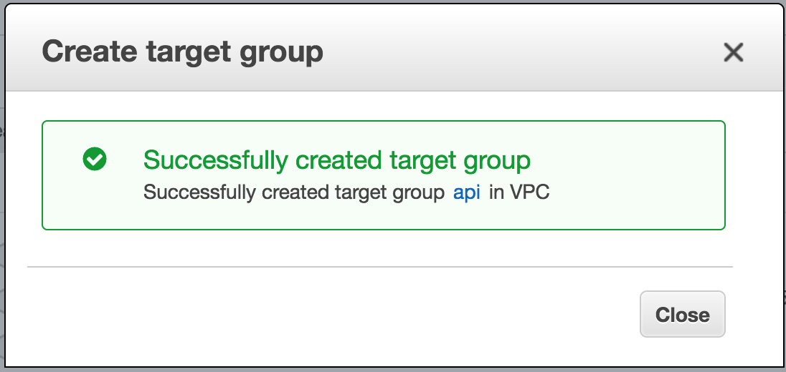
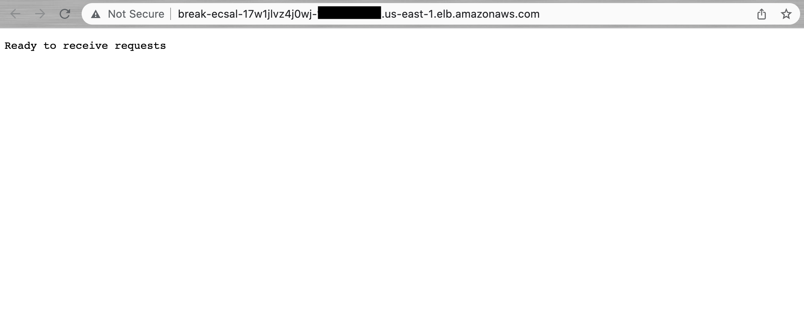

# monolith-app

Hello and welcome to the _Monolith App_ project!

## Overview

In this exciting project, we will deploy a monolithic node.js application to a Docker container, and then decouple the application into microservices. Next, the node.js application will host a simple message board with threads and messages between users.

Before we begin, let's learn some important concepts:

As the name suggests, **monolithic** architectures are traditionally resistant to change and difficult to scale. The “mono” prefix of the word "monolith", represents the single codebase which contains all of the functionalities. However, as an application's code base grows, it becomes increasingly difficult to manage.


Conversely, **microservices** architectures have independently-run applications which use APIs to communicate with other services. Each service performs a single function. Unlike the Monolith architecture, microservices are designed for failure. In theory, the failure of one microservice does not affect the system as a whole, and other functionalities remain accessible to the user. Additionally, microservices are capable of adopting a variety of technology stacks, which could be utilized for solving business challenges. This may include various frameworks and programming languages, which can be deployed independently, as a single service, or as a group of services.


How are all of these applications contained? - With containers, of course!
**Containers** are standard units of software that package an application's code, configurations, and dependencies. This allows applications to efficiently and reliably run from one computing environment to another!

There are many advantages to using containers, as outlined below:

- Fast deployment of applications
- Easy portability across machines
- Version control and component reuse 
- Agile suitable for continuous integration and deployment (CI/CD)
- Sharing capabilities
- Lightweight with minimal overhead
- Flexible & Easy to maintain


---------------------------------------------------------------------------------------------------------
## PART 1: Getting Started

Let's get started by ensuring that our computer system is up-to-date with the latest tools and software needed for this project.
### Setting up the system

**STEP 1: Amazon Web Services (AWS) Account** 
First and foremost, we need an AWS Account. If you do not have an existing account with AWS, [click here](https://portal.aws.amazon.com/gp/aws/developer/registration/index.html) to register for a free account! Once you have created your account, be sure to create or log in as an [IAM user](https://docs.aws.amazon.com/IAM/latest/UserGuide/id_users_create.html). This will ensure best security practice. 


**STEP 2: Docker Installation** 
In this section, we will install Docker. Docker is an open-source tool that is used to automate the deployment of applications as portable, self-sufficient containers. We will utilize Docker to build the image files which will then run in our containers. 

- _**Installing Docker for your Desktop**_

Download Docker for your Desktop at no cost [for Mac](https://docs.docker.com/docker-for-mac/install/) or [for Windows](https://docs.docker.com/docker-for-windows/install/). Be sure that your PC meets the system requirements! Follow the instructions provided on the website to install the software.


Alternatively, you can also install Docker on your Terminal!

- _**Installing Docker via Terminal**_

To ensure we get the latest version, we’ll install Docker from the official Docker repository. To do that, we’ll add a new package source, add the GPG key from Docker to ensure the downloads are valid, and then install the package.

Open Terminal and run the following command:

```
$ sudo apt update
```

When prompted, type in your regular user's password, then press `Enter`. 

Next, install a few prerequisite packages which let `apt` use packages over HTTPS using the following command:

```
$ sudo apt install apt-transport-https ca-certificates curl software-properties-common
```

After using this command, you will be prompted whether or not you wish to proceed. Type `Y`and then type `ENTER` to proceed with the instillation.

Next, add the GPG key for the official Docker repository to your system using the following command:

```
$ curl -fsSL https://download.docker.com/linux/ubuntu/gpg | sudo apt-key add -
```
You should see an output that says: `OK`

Next, add the Docker repository to `APT` sources using the following command:

```
$ sudo add-apt-repository "deb [arch=amd64] https://download.docker.com/linux/ubuntu $(lsb_release -cs) stable"
```

This will also update our package database with the Docker packages from the newly added repository.

Next, ensure that you are installing from the Docker repo, rather than the default Ubuntu repo, by running the following command:

```
$ apt-cache policy docker-ce
```

Finally, install Docker using the following command:

```
$ sudo apt install docker-ce
```
When prompted, press `Y` to continue instillation.

The instillation may take a few minutes. Once you have Docker is installed, you can verify that it is running by entering the following command in the Terminal of your local PC: 

```
$ docker --version
```

The output will be the _version number_, as shown in the following example:


**STEP 3: AWS Command Line Interface (CLI) Installation**
The AWS CLI will be utilized to push our images to Amazon ECR. Please [click here](http://docs.aws.amazon.com/cli/latest/userguide/installing.html) for detailed guide on installing the AWS CLI.

Similar to the previous example, once you have downloaded and installed the AWS CLI on your local PC, you can verify that it is running by entering the following command in the Terminal of your local PC:

```
$ aws --version
```

Once again, the output will be the _version number_, as shown in the following example:
        

    
_**Please Note:**_
If an older version of AWS CLI is already installed, run the following command in the Terminal to update it to the latest version:
        
```
$ pip3 install awscli --upgrade --user
```


**STEP 4: Code-Editor Download** 
If you do not have a code-editor, install one on your local environment for free! [Visual Studio Code](https://code.visualstudio.com/) is a recommended code-editor which is popular among developers!


**STEP 5: GitHub Repository Download** 
If you do not have an existing Github account, create one for free at [Github.com](https://github.com). 

Next, log into your account and navigate to the following repo on your web browser: 
[https://github.com/awslabs/amazon-ecs-nodejs-microservices](https://github.com/awslabs/amazon-ecs-nodejs-microservices)

Fork the Github repo, and select `Code` and then click `clone` link, in order to download the forked GitHub repository to your local environment.


In order to clone the repo to your Terminal, use the following command:

```jsx
$ git clone [clone-link]
```


**STEP 6: Access The Project Files** 
Alternatively, start your code editor (e.g. Visual Studio Code), and locate the folder where you saved the forked repository, called **amazon-ecs-nodejs-microservices**


**STEP 7: Create the repository on AWS**

- Navigate to the [Amazon ECR console](https://console.aws.amazon.com/ecs/home?#/repositories) and select **Create Repository**.


- On the **Create Repository** page, enter the following name for your repository: **`api`** 
(for reference, see image below).


- Leave all other options as default, then scroll to the bottom of the page and select **Create Repository**. You can view your repository in the `Repositories` section.


As shown above, once the repository is created, there will be a confirmation message showing with the repository address. The repository address is in the following format: 

**[account-id]*.dkr.ecr.*[region]*.amazonaws.com/*[repo-name]**

**Please Note:** the information within the brackets are unique values, and must be substituted with _your_ corresponding information.

Next, access your terminal and navigate to the following directory: 

```
cd ~/amazon-ecs-nodejs-microservices/2-containerized/services/api
```
Once you have reached the directory, use the following command to configure your account:

```
$ aws configure
```
Replace the values with the credentials displayed on your AWS account. For additional help with AWS configuration, [click here](https://docs.aws.amazon.com/cli/latest/userguide/cli-configure-quickstart.html) to learn more.

```
AWS Access Key ID [None]: Access Key
AWS Secret Access Key [None]: Secret Key
Default region name [None]: <your preferred region>
Default output format [None]: json
```


**STEP 8: Authenticate Docker log in via Terminal**

- Run the following command, replacing the information within the **anchor tabs < >** with _your_ **region** and **AWS account ID**

```jsx
$ aws ecr get-login-password \
    --region <region> \
| docker login \
    --username AWS \
    --password-stdin <aws_account_id>.dkr.ecr.<region>.amazonaws.com
```

If the authentication was successful, you will receive the confirmation message: **Login Succeeded**


- To build the image, run the following command in the terminal: 

```
$ docker build -t api .
```


- After the build completes, tag the image so you can push it to the repository: 
    
```jsx
$ docker tag api:latest [account-id].dkr.ecr.[region].amazonaws.com/api:latest
```

**Please Note:** Remember to replace the *[account-ID]* and *[region]* placeholders with your specific information.

- Next, push the image to Amazon ECR by running the following command:

```jsx
$ docker push [account-id].dkr.ecr.[region].amazonaws.com/api:latest
```

- Once you navigate to your Amazon ECR repository, you should see your image tagged *latest*.


**TROUBLESHOOTING**

It is possible that you may receive the following error message:

**_cannot connect to the Docker daemon at unix:///var/run/docker.sock. Is the docker daemon running?_**

To resolve this, navigate to the ECR repository page on the AWS console. Next, click `view push commands`. 


Copy and paste each command to your terminal and run them one at a time. This should resolve the issue.


----------------------------------------------------------------
## PART 2: Deploy the Monolith

In this section, we will use Amazon Elastic Container Service (Amazon ECS) to instantiate a managed cluster of EC2 compute instances and deploy your image as a container running on the cluster. 

**STEP 1:** Launch an ECS Cluster with CloudFormation

Begin by navigating to the [AWS CloudFormation console](https://console.aws.amazon.com/cloudformation/home) and select **Create stack**.


- Select **Upload a template file** and choose the [ecs.yml](https://github.com/awslabs/amazon-ecs-nodejs-microservices/blob/master/2-containerized/infrastructure/ecs.yml) file from the GitHub project at *amazon-ecs-nodejs-microservice/2-containerized/infrastructure/ecs.yml* then select **Next**.


- For the stack name, enter the following name: `BreakTheMonolith-Demo`. Verify that the other parameters have the following values, then click `Next`:

**Desired Capacity** = `2`

**InstanceType** = `t2.micro`

**MaxSize** = `2`


- On the **configure stack options** page, simply keep the default options, scroll down, and select `Next`.

- On the **Review BreakTheMonolith-Demo** page scroll to the bottom of the page, acknowledge the **capabilities statement** by selecting the checkbox, and then select `create stack` at the bottom-right of the page.


- You will see your stack with the status `CREATE_IN_PROGRESS`. This process typically takes under 5 minutes. Refresh the page. Once it is complete, you will see the status `CREATE_COMPLETE`.


**STEP 2:** Check that your Cluster is Running

Navigate to the [Amazon ECS console](https://console.aws.amazon.com/ecs/home?).Your cluster should appear in the list.


- Select the cluster **BreakTheMonolith-Demo**, then select the `Tasks` tab to verify that there are _no_ tasks running.


- Select the **ECS Instances** tab to verify there are two Amazon EC2 instances created by the AWS CloudFormation template.


**STEP 3:** Write a Task Definition

- From the **Amazon ECS** left navigation menu, select `Task Definitions`, then select `Create new Task Definition`.

- Next, in the **Select launch type compatibility** page, select the **EC2** option then select `Next step`.

- On the **Configure task and container definitions** page, do the following:

    - In the **Task Definition Name** field, enter `api`.
    - Scroll down to **Container Definitions** and select **Add container**.


In the **Add container** window, complete the following steps:
     
- In the **Container name** field, type `api`.
- In the **Image** field, enter the following

```
[account-ID].dkr.ecr.[region].amazonaws.com/api:latest
```

**Please Note:** Remember to replace *[account-ID]* and *[region]* with your specific information. This is the URL of your ECR repository image._

- In the **Memory Limits** field, verify **Hard limit** is selected and enter `256` as the value.
- Under **Port mappings**, Host port = `0` and Container port = `3000`.
- Scroll to **ENVIRONMENT**, CPU units = `256`.


- Select **Add**. You will return to the **Configure task and container definitions** page.
- Scroll to the bottom of the page and select **Create**.

Nice work! Your Task Definition is listed in the console!


**STEP 4:** Configure the ALB Target Group

- Navigate to the *Load Balancer* section of the EC2 Console, then search for the Load Balancer named **demo**.

- In the **Description** tab, scroll down and locate the **VPC** attribute (in this format: vpc-xxxxxxxxxxxxxxxxx). Take note of this because you will need this for the next step when you configure the ALB target group!


**STEP 5:** Configure the ALB Listener

- Navigate to the Target Group section of the EC2 Console and select **Create target group**.
- Configure the following Target Group parameters (for the parameters not listed below, keep the default values):
    - **Target group name** = `api`
    - **Protocol** = `HTTP`
    - **Port** = `80`
    - For the `VPC`, select the value that matches the one from the Load Balancer description.

- Access the **Advanced health check settings** and edit the following parameters as needed:
    - **Healthy threshold** = `2`
    - **Unhealthy threshold** = `2`
    - **Timeout** = `5`
    - **Interval** = `6`
    


Once you have entered these parameters, scroll down and select **Create**.



**STEP 6:** Add a Listener to the ALB

- Navigate to the Load Balancer section of the EC2 Console and select the checkbox next to **demo** to see the Load Balancer details.
- Select the **Listeners** tab.
- Select **Add listener** and edit the following parameters as needed:
    - For **Protocol:port**, select **HTTP** and enter `80`
    - For **Default action(s)**, select **Forward to** and in the **Target group** field, enter `api`
- Select **Save**.


**STEP 7:** Deploy the monolith as a service into the cluster.

- Navigate to the Amazon ECS console and select **Clusters** from the left menu bar.
- Select the cluster **BreakTheMonolith-Demo**, select the **Services** tab then select **Create**.
- On the **Configure service** page, edit the following parameters (and keep the default values for parameters not listed below):
    - **Launch type** = `EC2`
    - **Service name** = `api`
    - **Number of tasks** = `1`


    
- Once you have entered these parameters, select `Next step`.

- On the **Configure network** page, **Load balancing** section, select **Application Load Balancer**. Select the additional parameters that appear:
    - **Service IAM role** = `BreakTheMonolith-Demo-ECSServiceRole`
    - **Load balancer name** = verify that **demo** is selected.
- In the **Container to load balance** section, select **Add to load balancer**. In the **api:3000** section, enter the following:
    - **Production listener port** = `80:HTTP`
    - **Target group name** = `api`


- Once you have entered these parameters, select `Next step`.
- On the **Set Auto Scaling** page, leave all the default settings and select `Next step`.
- On the **Review** page, review the settings then select `Create Service`
- After the service has been created, select **View Service**.


Nice work! You now have a running service. It may take a minute for the container to register as healthy and begin receiving traffic.

**STEP 8:** Service URL

The node.js application routes traffic to each worker based on the URL. To see a worker, simply add the worker name api/[worker-name] to the end of the DNS Name as follows:

http://[DNS name]/api/users


http://[DNS name]/api/threads


http://[DNS name]/api/posts


You can also add a record number at the end of the URL to specify to a record. 

For example: **http://[DNS name]/api/users/2**


--------------------------------------------------------------------------------
## PART 3: Break the Monolith

In this section, we will break the node.js application into three interconnected services. In order to deploy the application as microservices, we must provision each of these repositories in Amazon ECR. Our three services are as follows:

1. users
2. threads
3. posts

**STEP 1:** Creating the repositories

- Begin by navigating to the Amazon ECR console, and selecting **Create repository**. In the **Create repository** page, **Repository name** field, create a repository for the service (posts, threads, or users).

You should have four repositories in Amazon ECR. Record the repository information for each microservice that you created. This information will be needed in an upcoming step. The information you need is in the following format:
`[account-id].dkr.ecr.[region].amazonaws.com/[service-name]`


You will need access to Docker to build and push the images for each service. If you are working on this project at different points in time, you may have been logged out of Docker. If this is the case, take the following steps to log into Docker again.

Run the following command:

```
$ aws ecr get-login-password --region us-east-1 | docker login --username AWS --password-stdin [account id]].dkr.ecr.[region].amazonaws.com
```

If the authentication was successful, you will receive the confirmation message: **Login Succeeded**.


Next, in your Terminal navigate to the following directory:

```
$ cd ~/amazon-ecs-nodejs-microservices/3-microservices/services
```

**Build and Tag Each Image**

- In the terminal, run 

```
$ docker build -t [service-name] ./[service-name]
```
**PLEASE NOTE:** Replace the [service-name]
_For example_: docker build -t posts ./posts


- After the build completes, tag the image so you can push it to the repository: 

```
$ docker tag [service-name]:latest [account-ID].dkr.ecr.[region].amazonaws.com/[service-name]:latest
```
**PLEASE NOTE:** Replace [service-name], [account-ID], and [region].
_For example_: docker tag posts:latest [account-id].dkr.ecr.us-west-2.amazonaws.com/posts:latest


- Lastly, push your image to ECR using the following command:

```
$ docker push [account-id].dkr.ecr.[region].amazonaws.com/[service-name]:latest

```


**Repeat these steps for each microservice image**.
Be sure to **build** and **tag** ALL three images.

--------------------------------------------------------------------------------
## PART 4: Deploy Microservices

In this section, we will deploy our node.js application as a set of interconnected services behind an Application Load Balancer (ALB). Next, we will use the ALB to shift traffic from the monolith to the microservices. In order to achieve this, we must deploy our three new services to the cluster, and then write Task Definitions for each service.

**STEP 1:** Writing Task Definitions for our Service

- Begin by Navigating to the Amazon Container Services console. Underneath the **Amazon ECS**, select **Task Definitions**.

- In the **Task Definitions** page, select the **Create new Task Definition** button.

- In the **Select launch type compatibility** page, select the **EC2** option and then select **Next step**.

- In the Configure task and container definitions page, scroll to the **Volumes** section and select the **Configure via JSON** button.

- Copy and paste the following code snippet into the JSON field. 

**PLEASE NOTE**
_Remember to replace the [service-name], [account-ID], [region], and [tag] placeholders._

```bash
{
    "containerDefinitions": [
        {
            "name": "[service-name]",
            "image": "[account-id].dkr.ecr.[region].amazonaws.com/[service-name]:[tag]",
            "memoryReservation": "256",
            "cpu": "256",
            "essential": true,
            "portMappings": [
                {
                    "hostPort": "0",
                    "containerPort": "3000",
                    "protocol": "tcp"
                }
            ]
        }
    ],
    "volumes": [],
    "networkMode": "bridge",
    "placementConstraints": [],
    "family": "[service-name]"
}
```

**Repeat the steps above and to create a task definition for each service:**

- posts
- threads
- users


**STEP 2:** Configure the ALB Target Groups

In your terminal, use the following command (see below) to create a target group for each service (posts, threads, and users):

In addition, we must also create a target group (drop-traffic) to keep traffic from reaching your monolith after our microservices are fully running: 

Service names: 
- **posts**
- **threads**
- **users**
- **drop-traffic**


command:

>```$ aws elbv2 create-target-group --region [region] --name [service-name] --protocol HTTP --port 80 --vpc-id [vpc-attribute] --healthy-threshold-count 2 --unhealthy-threshold-count 2 --health-check-timeout-seconds 5 --health-check-interval-seconds 6```

**Please note:** _Once again, remember to replace the following placeholders: [region], [service-name], and [vpc-attribute]._


**STEP 3:** Configure the listener rules

- Navigate to the Load Balancer section of the EC2 Console and locate the Load Balancer named **demo**. 
- Select the checkbox next to it to see the Load Balancer details, then select the **Listeners** tab.
- Under the **Rules** column, select **View/edit rules**, then select the plus (**+**) button.
- Use the following rule template to insert the necessary rules which include one to maintain traffic to the monolith and one for each microservice:
    - IF Path = /api/[service-name]* THEN Forward to [service-name]
    (_For example_: IF Path = /api/posts* THEN Forward to posts)
    - Insert the rules in the following order:
        - **api:** */api** forwards to *api*
        - **users:** */api/users** forwards to *users*
        - **threads:** */api/threads** forwards to *threads*
        - posts: */api/posts** forwards to *posts*
- Select **Save**.


**STEP 4:** Deploy the microservices

In order to deploy the three microservices (posts, threads, and users) to our cluster. Repeat these steps for each of the three microservices:

- Navigate to the Amazon ECS console and select **Clusters** from the left menu bar, then select the cluster **BreakTheMonolith-Demo**.
- Next, select the **Services** tab then select **Create**.

On the **Configure service** page, edit the following parameters (and keep the default values for parameters not listed below):
- **Launch type** = `EC2`
- For the **Task Definition**, select the **Enter a value** button to automatically select the highest revision value.
(_For example_: api:1)
- For the **Service name**, enter a service name (*posts, threads, or users*).
- **Number of tasks** = `1`
- Select **Next step**.


On the **Configure network** page, **Load balancing** section, do the following:
- **Load balancer type** = `Application Load Balancer`
- **Service IAM role** = `BreakTheMonolith-Demo-ECSServiceRole`
- **Load balancer name** = `demo`

In the **Container to load balance** section, select the **Add to load balancer** button and make the following edits:
- **Production listener port** = `80:HTTP`
- For the **Target group name**, select the appropriate group: (**posts**, **threads**, or **users**)
- Select **Next step**.


On the **Set Auto Scaling** page, select **Next step**.

On the **Review** page, select **Create Service**, then select **View Service**.

**Remember to repeat these steps above for each of the three microservices.**

It should only take a few seconds for all your services to start. Double check that all services and tasks are running and active before you proceed.


**STEP 4:** Switch Traffic to Microservices

Great job! Our microservices are now running. However, all traffic is still flowing to your monolith service. 

To reroute traffic to the microservices, take the following steps to update the listener rules:

- Navigate to the Load Balancers section of the EC2 Console] then select the checkbox next to **demo** to see the Load Balancer details.
- Select the **Listeners** tab, and under the **Rules** column, select **View/edit rules**.
- On the **Rules** page, select the minus (**-**) button from the top menu.
- Delete the first rule (*/api* forwards to api*) by selecting the checkbox next to the rule.
- Select **Delete**.

To update the default rule to forward to drop-traffic:
    - Select the edit (pencil) icon next to the default rule (**HTTP 80: default action**).
    - Select
     the edit (pencil) icon in the **THEN** column to edit the **Forward to**.
    - In the **Target group** field, select **drop-traffic**.
    - Select the **Update** button.

See the following screenshot for an example of the updated rules.


Now that we have traffic flowing to our microservices, we can disable the monolith service.

- Navigate back to the Amazon ECS cluster **BreakTheMonolith-Demo-ECSCluster**.
- In the **Services** tab, select the checkbox next to **api** and select **Update**.
- On the **Configure service** page, locate **Number of tasks** and enter `0`.
- Select **Skip to review**.
- Select **Update Service**.


**Great work! we now fully transitioned your node.js from the monolith to microservices, without any downtime!**

**STEP 5:** Validate your Deployment

- Locate your service URL, then navigate to the Load Balancers section of the EC2 console.
- Select the checkbox next to **demo** to see the Load Balancer details.
- In the **Description** tab, locate the **DNS name** and select the copy icon at the end of the URL.
- Paste the DNS name into a new browser tab or window.

You should see a message 'Ready to receive requests'.



Keep in mind that these URLs perform exactly the same as when the monolith was deployed. Amazingly, moving from monolith to microservices required no changes to other parts of your infrastructure!

--------------------------------------------------------------------------------
## PART 5: Clean Up

In this section, we will terminate the resources that were created during this tutorial. This will help to avoid charges from AWS.

**Services Used:**
- Amazon Elastic Container Service
- Amazon Elastic Container Registry
- Amazon EC2
- Amazon VPC
- Elastic Load Balancing


**STEP 1:** Stop Services

Begin by deleting each of the services (posts, threads, abd users) that are running in your cluster:

- Navigate to the Amazon ECS console and select **Clusters**.
- Next, select the **BreakTheMonolith-Demo** cluster.
- In the **Services** tab, select a service and then select **Delete**.
- Confirm the deletion.
- Repeat the steps until all of the services are deleted.

**PLEASE NOTE:** Repeat these steps for each of your services on the cluster.


**STEP 2:** Delete Listeners
- Navigate to the `Load Balancer` section of the EC2 Console, then select the checkbox next to **demo** and select the **Listeners** tab.
- Select the listener, then select **Delete**.
- Confirm the deletion.


**STEP 3:** Delete Target Groups
- Next, navigate to `Target Groups` in the EC2 console. Check the checkbox at the top of the list (next to **Name**) to select all target groups. Select **Actions** then select **Delete**.


**STEP 4:** Delete CloudFormation Stack
- Navigate to the AWS CloudFormation console, then check the box next to the Cloudformation stack **BreakTheMonolith-Demo**.
- Select **Actions** then select **Delete Stack**.
- Confirm the deletion.
- The stack status should change to `DELETE_IN_PROGRESS`


**STEP 5:** Deregister Task Definitions
- Navigate to `Task Definitions` in the Amazon ECR console, then select a task definition (api, posts, threads, or users).
- On the **Task Definition Name** page, select the checkbox next to the task name.
- Select **Actions** then from the drop-down list select **Deregister**.

**PLEASE NOTE** Repeat these steps for each of your services on the cluster.


**STEP 6:** Delete ECR Repositories
Navigate to Repositories in the Amazon ECR console and select the checkbox next to a repository and then select **Delete**.
- Confirm the deletion.
- Repeat the steps until all the repositories are deleted.


------------------------------------------------------------

**Congratulations!!!**

# You Just Broke the Monolith!